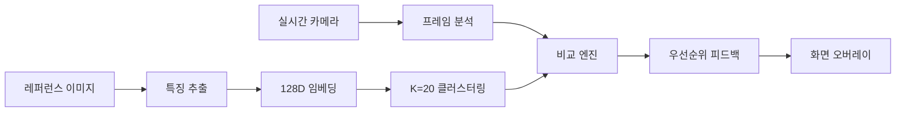

# 📸 TryAngle

> **AI-Powered Photography Guide System**
> 레퍼런스 이미지를 분석하여 실시간으로 촬영 가이드를 제공하는 AI 시스템

[](https://www.python.org/)
[](https://pytorch.org/)
[](https://opencv.org/)
[](LICENSE)
[]()

---

## 프로젝트 소개

**TryAngle**은 사진 촬영 초보자도 전문가처럼 찍을 수 있도록 돕는 AI 기반 실시간 촬영 가이드 시스템입니다.

### 핵심 아이디어

1. **레퍼런스 이미지**를 선택하세요 (원하는 스타일의 사진)
2. **실시간 카메라**로 피사체를 촬영하세요
3. AI가 **실시간으로 가이드**를 제공합니다:
   - 📏 거리: "2걸음 뒤로 가세요"
   - 💡 밝기: "EV +0.5 밝게 조정하세요"
   - 🎨 색감: "채도를 높이세요"
   - 📐 구도: "3° 반시계방향 회전하세요"
   - 🤸 포즈: "왼팔을 15° 더 올리세요"

---

## 주요 기능

### 11가지 분석 카테고리

| 카테고리 | 분석 내용 | 피드백 예시 |
|---------|---------|------------|
| 🎨 **스타일** | 클러스터링 기반 스타일 매칭 | "실외/멀리/쿨톤/반신 스타일" |
| 🤸 **포즈** | YOLO11 + MediaPipe | "왼팔을 15° 더 올리세요" |
| 📷 **카메라 설정** | EXIF 분석 | "ISO 400으로 설정하세요" |
| 🔍 **품질** | 노이즈, 블러, 선명도, 대비 | "레퍼런스보다 34% 더 흐려요" |
| 💡 **조명** | 방향, 역광, HDR | "조명을 왼쪽으로 이동하세요" |
| 📏 **거리** | MiDaS depth 추정 | "2걸음 뒤로 가세요" |
| 💡 **밝기** | EV 조정 | "EV +0.5 밝게 하세요" |
| 🎨 **색감** | 채도, 색온도 | "채도를 낮추세요" |
| 📐 **구도** | 기울기, 무게중심 | "3° 시계방향 회전" |
| 🖼️ **프레이밍** | 줌 비율 | "화면 1.3배 확대" |
| ⚖️ **대칭성** | 좌우 균형 | "왼쪽으로 20% 이동" |

### 핵심 기술



**AI 모델:**
- **CLIP** (OpenAI): 이미지 특징 추출
- **YOLO11-pose**: 인물 포즈 검출
- **MediaPipe**: 정밀 관절 분석
- **MiDaS**: Depth 추정
- **UMAP**: 차원 축소 & 클러스터링

*성능 최적화:*
-  [글톤 패턴]: 모델 한 번만 로드 (2배 속도 향상)
-  [비동기 분석]: 백그라운드 스레드로 UI 끊김 없음
-  [캐싱]: 두 번째 이미지부터 로딩 시간 0초

---

## 🎬 데모

### 실시간 피드백 화면

```
┌────────────────────────────────────────────────┐
│ TryAngle - Realtime Guide | FPS: 28.5          │
├────────────────────────────────────────────────┤
│  스타일: 실외/멀리/쿨톤/반신 ✓                       │
│                                                │
│  1. [DISTANCE] 2걸음 뒤로                        │
│  2. [BRIGHTNESS] EV +0.7 (밝게)                 │
│  3. [COMPOSITION] 3° 반시계방향 회전               │
└────────────────────────────────────────────────┘
```

### 분석 결과 예시

```python
 촬영 가이드

 스타일: 실외 / 멀리, 쿨톤, 중간, 반신 ✓

 촬영 조정 사항:
   1. [DISTANCE] 2걸음 뒤로
      └ 거리 비율: 1.23

   2. [BRIGHTNESS] EV +0.7 (밝게)
      └ 밝기 차이: +21.3

   3. [COMPOSITION] 3° 반시계방향 회전
      └ 기울기 차이: -3.2°
```

---

## 설치 및 실행

### 요구사항

- Python 3.10+
- CUDA (GPU 사용 시, 선택)
- 웹캠 또는 카메라

### 설치 (Windows)

```bash
# 1. 저장소 클론
git clone https://github.com/hyunsoo93049/Try_Angle.git
cd Try_Angle

# 2. 가상환경 생성
conda create -n TA python=3.10 -y
conda activate TA

# 3. 필수 패키지 설치
pip install opencv-python numpy pillow pyyaml
pip install torch torchvision
pip install ultralytics mediapipe
pip install scikit-learn pandas timm umap-learn

# 4. 모델 파일 다운로드 (Google Drive 또는 별도 제공)
# - feature_models/
# - features/
# - data/test_images/

# 5. 실행
cd src/Multi/version3
python camera_realtime.py
```

### 설치 (macOS)

**자세한 가이드**: [`MAC_SETUP.md`](src/Multi/version3/MAC_SETUP.md)

```bash
# 1-3단계 동일

# 4. Apple Silicon 최적화 (M1/M2/M3)
# PyTorch MPS 자동 지원

# 5. 실행
cd src/Multi/version3
python camera_realtime.py
```

###  조작법

| 키 | 기능 |
|----|------|
| `q` | 종료 |
| `r` | 레퍼런스 재분석 |
| `s` | 현재 프레임 저장 |
| `SPACE` | 분석 일시정지/재개 |

---

##  프로젝트 구조

```
Try_Angle/
├── src/Multi/version3/              # 🎯 메인 코드
│   ├── camera_realtime.py           # 실시간 카메라 시스템
│   ├── config.yaml                  # 크로스 플랫폼 설정
│   ├── main_feedback.py             # 이미지 비교 피드백
│   │
│   ├── analysis/                    # 분석 모듈
│   │   ├── image_analyzer.py        # 통합 분석기
│   │   ├── image_comparator.py      # 비교 엔진
│   │   ├── pose_analyzer.py         # 포즈 분석
│   │   ├── exif_analyzer.py         # EXIF 추출
│   │   ├── quality_analyzer.py      # 품질 분석
│   │   └── lighting_analyzer.py     # 조명 분석
│   │
│   ├── feature_extraction/          # 특징 추출
│   │   └── feature_extractor_v2.py  # CLIP 기반 추출
│   │
│   ├── matching/                    # 클러스터 매칭
│   │   └── cluster_matcher.py       # K=20 매처
│   │
│   ├── embedder/                    # 임베딩
│   │   └── embedder.py              # 128D 임베딩
│   │
│   ├── utils/                       # 유틸리티
│   │   └── model_cache.py           # 싱글톤 캐싱
│   │
│   └── training/                    # 학습 스크립트
│       ├── retrain_features.py
│       └── retrain_clustering.py
│
├── feature_models/                  # 학습된 모델 (Git LFS)
├── features/                        # 클러스터 정보
└── data/                           # 데이터셋
    ├── clustered_images/           # 클러스터별 이미지
    └── test_images/                # 테스트 이미지
```

---

## 기술 아키텍처

### 파이프라인

```
1. 특징 추출 (Feature Extraction)
   └─ CLIP → 512D 벡터

2. 임베딩 (Embedding)
   └─ Autoencoder → 128D 압축

3. 클러스터링 (Clustering)
   └─ UMAP + K-Means (K=20)

4. 비교 (Comparison)
   ├─ 클러스터 매칭
   ├─ 픽셀 분석 (밝기, 색감)
   ├─ Depth 추정 (MiDaS)
   ├─ 포즈 비교 (YOLO + MediaPipe)
   └─ EXIF 추출

5. 피드백 생성 (Feedback)
   └─ 우선순위 기반 정렬
```

### 주요 알고리즘

**1. 상대적 평가 (Relative Evaluation)**
```python
# 절대적 평가 (Before)
if blur < 100:
    feedback = "사진이 흐려요"

# 상대적 평가 (After)
if ref_blur < 100:  # 레퍼런스가 흐림 = 의도된 스타일
    priority = 8.0  # 낮은 우선순위
else:
    priority = 1.0  # 높은 우선순위
```

**2. 동적 우선순위 (Dynamic Priority)**
```python
feedback.sort(key=lambda x: x["priority"])
# 0: 정보성 (스타일)
# 0.5: 포즈
# 1: 카메라 설정
# 2: 거리
# 3: 밝기
# ...
```

---

##성능

### 분석 속도

| 작업 | 첫 실행 | 두 번째 이후 |
|-----|---------|--------------|
| 모델 로딩 | ~5초 | **0초** ⚡ |
| 이미지 분석 | ~5초 | ~5초 |
| 실시간 FPS | - | 25-30 FPS |

### 모델 크기

| 모델 | 크기 |
|------|------|
| CLIP | ~600MB |
| YOLO11-pose | ~22MB |
| MiDaS | ~100MB |
| 클러스터 모델 | ~50MB |
| **Total** | **~770MB** |

---

## 협업

프로젝트에 기여하고 싶으시다면:

1. Fork the repository
2. Create your feature branch (`git checkout -b feature/AmazingFeature`)
3. Commit your changes (`git commit -m 'Add some AmazingFeature'`)
4. Push to the branch (`git push origin feature/AmazingFeature`)
5. Open a Pull Request

---

## 라이선스

This project is licensed under the MIT License - see the [LICENSE](LICENSE) file for details.

---

## 팀
- 소속 : 중앙대학교 예술공학부
- 기획 : [김현수]
- UX/UI 디자인 : [최승혜, 김세영, 이윤균]
- 카메라 개발 : [전은서]
- 알고리즘 및 AI개발 : [김현수]

---

## 문서

- [Quick Reference](src/Multi/version3/QUICK_REFERENCE.md) - 빠른 시작 가이드
- [Mac Setup](src/Multi/version3/MAC_SETUP.md) - macOS 설치 가이드
- [Design Doc](src/Multi/version3/DESIGN_QUALITY_LIGHTING.md) - 상세 설계 문서
- [Changelog](src/Multi/version3/CHANGELOG.md) - 변경 이력

---

## Acknowledgments

- [OpenAI CLIP](https://github.com/openai/CLIP) - Image feature extraction
- [Ultralytics YOLO](https://github.com/ultralytics/ultralytics) - Pose detection
- [Google MediaPipe](https://google.github.io/mediapipe/) - Precise keypoint tracking
- [Intel MiDaS](https://github.com/isl-org/MiDaS) - Depth estimation
