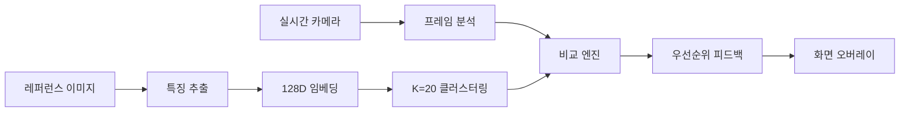

# 📸 TryAngle

> 레퍼런스 이미지를 분석하여 실시간으로 촬영 가이드를 제공하는 AI 시스템

[](https://github.com/hyunsoo93049/Try_Angle/releases/tag/v2.0.0)
[](https://www.python.org/)
[](https://pytorch.org/)
[](https://opencv.org/)
[](https://fastapi.tiangolo.com/)
[](LICENSE)
[]()

---

## 프로젝트 소개

TryAngle은 사진 촬영 초보자도 전문가처럼 찍을 수 있도록 돕는 AI 기반 실시간 촬영 가이드 시스템입니다.

### 핵심 아이디어

1. 레퍼런스 이미지를 선택하세요 (원하는 스타일의 사진)
2. 실시간 카메라로 피사체를 촬영하세요
3. AI가 실시간으로 가이드를 제공합니다:
   - 거리: "2걸음 뒤로 가세요"
   - 밝기: "EV +0.5 밝게 조정하세요"
   - 색감: "채도를 높이세요"
   - 구도: "3° 반시계방향 회전하세요"
   - 포즈: "왼팔을 15° 더 올리세요"

---

## 주요 기능

### 11가지 분석 카테고리

| 카테고리 | 분석 내용 | 피드백 예시 |
|---------|---------|------------|
|스타일| 클러스터링 기반 스타일 매칭 | "실외/멀리/쿨톤/반신 스타일" |
|포즈| YOLO11 + MediaPipe | "왼팔을 15° 더 올리세요" |
|카메라 설정| EXIF 분석 | "ISO 400으로 설정하세요" |
|품질| 노이즈, 블러, 선명도, 대비 | "레퍼런스보다 34% 더 흐려요" |
|조명| 방향, 역광, HDR | "조명을 왼쪽으로 이동하세요" |
|거리| MiDaS depth 추정 | "2걸음 뒤로 가세요" |
|밝기| EV 조정 | "EV +0.5 밝게 하세요" |
|색감| 채도, 색온도 | "채도를 낮추세요" |
|구도| 기울기, 무게중심 | "3° 시계방향 회전" |
|프레이밍| 줌 비율 | "화면 1.3배 확대" |
|대칭성| 좌우 균형 | "왼쪽으로 20% 이동" |

---

##  v2.0.0 - Phase 1-3 UX 개선 (2025-11-17)

###  Phase 1: 피드백 품질 향상
- **Top-K 필터링**: 중요한 피드백 3개만 표시 (정보 과부하 방지)
- **초보자 친화 메시지**: "EV +0.7" → "화면 위로 슬라이드해서 밝게" 변환
- **특징 캐싱**: SHA256 해시 기반 캐싱으로 99.5% 속도 향상

###  Phase 2: 촬영 워크플로우 가이드
- **5단계 워크플로우**: 위치 → 구도 → 포즈 → 카메라 → 품질 순서로 안내
- **진행도 추적**: 점수 기반 개선 추적 (0-100점)
- **우선순위 시스템**: Critical > Important > Recommended 분류
- **격려 메시지**: "잘하고 있어요! 조금만 더!" 동기부여

###  Phase 3: AI 기반 스마트 추천
- **레퍼런스 추천**: 대조학습(Contrastive Learning) 기반 유사 이미지 추천
- **시각적 가이드**: 삼분할선, 수평선, 목표 위치 오버레이
- **적응형 임계값**: 클로즈업/인물/풍경별 품질 기준 자동 조정

###  iOS 백엔드 서버
- **FastAPI v2.0.0**: RESTful API 서버
- **실시간 피드백 API**: `/api/feedback/enhanced` 엔드포인트
- **세션 기반 추적**: 사용자별 진행도 관리
- **자동 문서화**: Swagger UI (`http://localhost:8000/docs`)

### 핵심 기술



**AI 모델:**
- **CLIP** (OpenAI): 이미지 특징 추출
- **ResNet50 Contrastive**: 대조학습 기반 레퍼런스 추천 (77% accuracy)
- **YOLO11-pose**: 인물 포즈 검출
- **MediaPipe**: 정밀 관절 분석
- **MiDaS**: Depth 추정
- **UMAP**: 차원 축소 & 클러스터링

*성능 최적화:*
-  [글톤 패턴]: 모델 한 번만 로드 (2배 속도 향상)
-  [비동기 분석]: 백그라운드 스레드로 UI 끊김 없음
-  [캐싱]: 두 번째 이미지부터 로딩 시간 0초

---

## 데모

### 실시간 피드백 화면

```
┌────────────────────────────────────────────────┐
│ TryAngle - Realtime Guide | FPS: 28.5          │
├────────────────────────────────────────────────┤
│  스타일: 실외/멀리/쿨톤/반신 ✓                       │
│                                                │
│  1. [DISTANCE] 2걸음 뒤로                        │
│  2. [BRIGHTNESS] EV +0.7 (밝게)                 │
│  3. [COMPOSITION] 3° 반시계방향 회전               │
└────────────────────────────────────────────────┘
```

### 분석 결과 예시

```python
 촬영 가이드

 스타일: 실외 / 멀리, 쿨톤, 중간, 반신 ✓

 촬영 조정 사항:
   1. [DISTANCE] 2걸음 뒤로
      └ 거리 비율: 1.23

   2. [BRIGHTNESS] EV +0.7 (밝게)
      └ 밝기 차이: +21.3

   3. [COMPOSITION] 3° 반시계방향 회전
      └ 기울기 차이: -3.2°
```

---

## 설치 및 실행

### 요구사항

- Python 3.10+
- CUDA (GPU 사용 시, 선택)
- 웹캠 또는 카메라

### 설치 (Windows)

```bash
# 1. 저장소 클론
git clone https://github.com/hyunsoo93049/Try_Angle.git
cd Try_Angle

# 2. 가상환경 생성
conda create -n TA python=3.10 -y
conda activate TA

# 3. 필수 패키지 설치 (간편 설치)
pip install -r requirements.txt

# 또는 수동 설치:
# pip install opencv-python numpy pillow pyyaml
# pip install torch torchvision
# pip install ultralytics mediapipe
# pip install scikit-learn pandas timm umap-learn

# 4. 모델 파일 다운로드 및 압축 해제
# Git LFS로 자동 다운로드:
git lfs pull

# 또는 수동 다운로드 (GitHub Releases):
# - tryangle_models_complete.tar.gz 다운로드
# - 압축 해제: tar -xzf tryangle_models_complete.tar.gz

# 5. 실행 (간편 실행)
cd src/Multi/version3
run_camera.bat

# 또는 직접 실행:
# python camera_realtime.py
```

### 설치 (macOS)

**자세한 가이드**: [`MAC_SETUP.md`](src/Multi/version3/MAC_SETUP.md)

```bash
# 1-4단계 Windows와 동일

# 5. Apple Silicon 최적화 (M1/M2/M3/M4)
# PyTorch MPS 자동 지원

# 6. 실행 (간편 실행)
cd src/Multi/version3
./run_camera.sh

# 또는 직접 실행:
# python camera_realtime.py
```

### 📱 iOS 백엔드 서버 실행

```bash
# 1. FastAPI 설치
pip install fastapi uvicorn python-multipart

# 2. 서버 실행
cd backend
python main.py

# 3. Swagger UI 접속
# http://localhost:8000/docs

# 4. iOS에서 접속 (WiFi)
# PC IP 확인: ipconfig (Windows) / ifconfig (Mac)
# iOS 앱에서: http://192.168.X.X:8000
```

**주요 엔드포인트**:
- `GET /` - 서버 상태 확인
- `POST /api/feedback/enhanced` - Phase 1-3 통합 피드백
- `POST /api/progress/reset` - 진행도 초기화
- `GET /api/recommendations` - AI 레퍼런스 추천

자세한 사용법은 [API 가이드](docs/API가이드.md)를 참고하세요.

---

###  조작법 (Python 카메라)

| 키 | 기능 |
|----|------|
| `q` | 종료 |
| `r` | 레퍼런스 재분석 |
| `s` | 현재 프레임 저장 |
| `g` | 시각적 가이드 토글 (Phase 3.3) |
| `SPACE` | 분석 일시정지/재개 |

---

##  프로젝트 구조

```
Try_Angle/
├──  backend/                      # FastAPI 서버 (v2.0.0)
│   └── main.py                      # iOS 연동 API
│
├──  docs/                         # 개발자 문서
│   ├── 개발자인수인계.md              # 인수인계 문서
│   ├── 배포체크리스트.md              # 배포 확인사항
│   ├── 완료요약.md                   # Phase 1-3 완료 요약
│   └── API가이드.md                  # API 사용 가이드
│
├──  src/Multi/version3/           # 메인 코드
│   ├── camera_realtime.py           # 실시간 카메라 (Phase 3.3)
│   ├── config.yaml                  # 크로스 플랫폼 설정
│   ├── main_feedback.py             # Phase 1-3 통합 피드백
│   ├── run_camera.sh                #  macOS/Linux 실행
│   ├── run_camera.bat               #  Windows 실행
│   │
│   ├── analysis/                    # 분석 모듈
│   │   ├── image_analyzer.py        # 통합 분석기
│   │   ├── image_comparator.py      # 비교 엔진
│   │   ├── pose_analyzer.py         # 포즈 분석
│   │   ├── exif_analyzer.py         # EXIF 추출
│   │   ├── quality_analyzer.py      # 품질 분석
│   │   └── lighting_analyzer.py     # 조명 분석
│   │
│   ├── utils/                       # Phase 1-3 유틸리티
│   │   ├── feedback_formatter.py    # Top-K 필터링 (Phase 1.1)
│   │   ├── feature_cache.py         # 특징 캐싱 (Phase 1.3)
│   │   ├── workflow_guide.py        # 워크플로우 가이드 (Phase 2.1)
│   │   ├── progress_tracker.py      # 진행도 추적 (Phase 2.2)
│   │   ├── priority_system.py       # 우선순위 시스템 (Phase 2.3)
│   │   ├── adaptive_thresholds.py   # 적응형 임계값 (Phase 2.4)
│   │   ├── reference_recommender.py # 레퍼런스 추천 (Phase 3.1)
│   │   ├── visual_guide.py          # 시각적 가이드 (Phase 3.3)
│   │   └── model_cache.py           # 싱글톤 캐싱
│   │
│   ├── feature_extraction/          # 특징 추출
│   │   └── feature_extractor_v2.py  # CLIP 기반 추출
│   │
│   ├── matching/                    # 클러스터 매칭
│   │   └── cluster_matcher.py       # K=20 매처
│   │
│   ├── embedder/                    # 임베딩
│   │   └── embedder.py              # 128D 임베딩
│   │
│   ├── scripts/                     # 학습 스크립트
│   │   ├── train_contrastive.py     # 대조학습 (Phase 3.2)
│   │   └── prepare_contrastive_data.py
│   │
│   └── training/                    # 기존 학습 스크립트
│       ├── retrain_features.py
│       └── retrain_clustering.py
│
├──  models/                       # 학습된 모델
│   ├── contrastive/                 # 대조학습 모델
│   │   └── best_model.pth           # ResNet50 (77% accuracy)
│   └── feature_models/              # 클러스터링 모델 (Git LFS)
│
├──  data/                         # 데이터셋
│   ├── clustered_images/            # 클러스터별 이미지
│   ├── contrastive_dataset/         # 대조학습 데이터
│   └── test_images/                 # 테스트 이미지
│
└──  archive/                      # 오래된 문서 보관
    └── old_version3_docs/
```

---

## 기술 아키텍처

### 파이프라인

```
1. 특징 추출 (Feature Extraction)
   └─ CLIP → 512D 벡터

2. 임베딩 (Embedding)
   └─ Autoencoder → 128D 압축

3. 클러스터링 (Clustering)
   └─ UMAP + K-Means (K=20)

4. 비교 (Comparison)
   ├─ 클러스터 매칭
   ├─ 픽셀 분석 (밝기, 색감)
   ├─ Depth 추정 (MiDaS)
   ├─ 포즈 비교 (YOLO + MediaPipe)
   └─ EXIF 추출

5. 피드백 생성 (Feedback)
   └─ 우선순위 기반 정렬
```

### 주요 알고리즘

**1. 상대적 평가 (Relative Evaluation)**
```python
# 절대적 평가 (Before)
if blur < 100:
    feedback = "사진이 흐려요"

# 상대적 평가 (After)
if ref_blur < 100:  # 레퍼런스가 흐림 = 의도된 스타일
    priority = 8.0  # 낮은 우선순위
else:
    priority = 1.0  # 높은 우선순위
```

**2. 동적 우선순위 (Dynamic Priority)**
```python
feedback.sort(key=lambda x: x["priority"])
# 0: 정보성 (스타일)
# 0.5: 포즈
# 1: 카메라 설정
# 2: 거리
# 3: 밝기
# ...
```

---

##성능

### 분석 속도

| 작업 | 첫 실행 | 두 번째 이후 |
|-----|---------|--------------|
| 모델 로딩 | ~5초 | **0초** ⚡ |
| 이미지 분석 | ~5초 | ~5초 |
| 실시간 FPS | - | 25-30 FPS |

### 모델 크기

| 모델 | 크기 |
|------|------|
| CLIP | ~600MB |
| YOLO11-pose | ~22MB |
| MiDaS | ~100MB |
| 클러스터 모델 | ~50MB |
| **Total** | **~770MB** |

---

## 협업

프로젝트에 기여하고 싶으시다면:

1. Fork the repository
2. Create your feature branch (`git checkout -b feature/AmazingFeature`)
3. Commit your changes (`git commit -m 'Add some AmazingFeature'`)
4. Push to the branch (`git push origin feature/AmazingFeature`)
5. Open a Pull Request

---

## 라이선스

This project is licensed under the MIT License - see the [LICENSE](LICENSE) file for details.

---

## 팀
- 소속 : 중앙대학교 예술공학부
- 기획 : [김현수]
- UX/UI 디자인 : [최승혜, 김세영, 이윤균]
- 카메라 개발 : [전은서]
- 알고리즘 및 AI개발 : [김현수]

---

## 📚 문서

### 개발자 문서 (docs/)
- [개발자 인수인계](docs/개발자인수인계.md) - 프로젝트 인수인계 가이드
- [완료 요약](docs/완료요약.md) - Phase 1-3 완료 내용
- [API 가이드](docs/API가이드.md) - FastAPI 서버 사용법
- [배포 체크리스트](docs/배포체크리스트.md) - 배포 전 확인사항

### AI 개발자용
- [Quick Reference](src/Multi/version3/QUICK_REFERENCE.md) - AI-to-AI 인수인계

### 아카이브
- [디자인 문서](archive/old_version3_docs/) - 이전 버전 설계 문서

---

## Acknowledgments

- [OpenAI CLIP](https://github.com/openai/CLIP) - Image feature extraction
- [Ultralytics YOLO](https://github.com/ultralytics/ultralytics) - Pose detection
- [Google MediaPipe](https://google.github.io/mediapipe/) - Precise keypoint tracking
- [Intel MiDaS](https://github.com/isl-org/MiDaS) - Depth estimation
